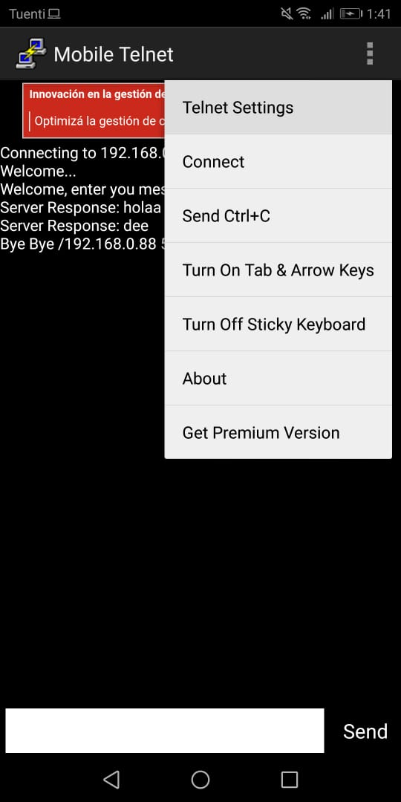
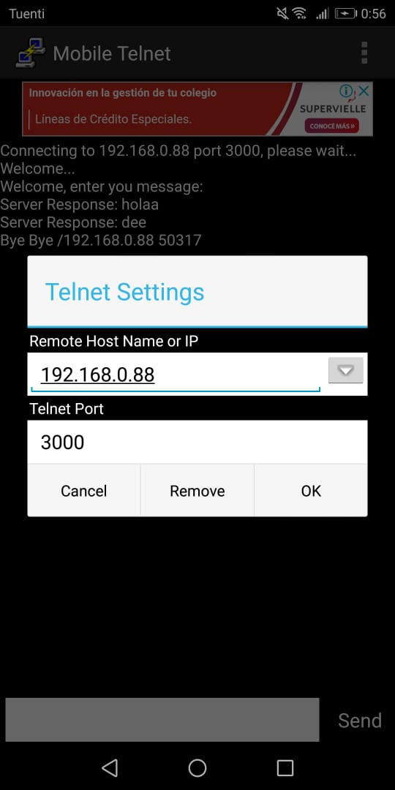
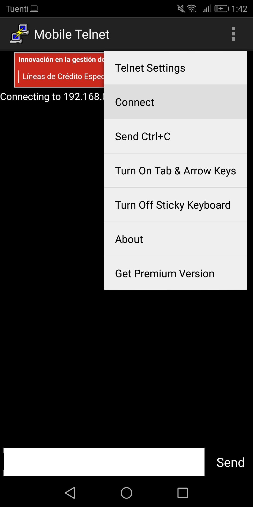
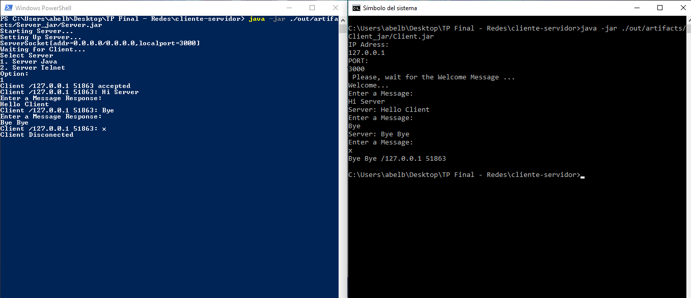

# Sockets TCP/IP

<p align="center">
    
</p>


## How to use 

This repository needs to run two shells or terminals.

### Clone Repository

Just run that quick commands on your terminal to clone that repo
```
git clone https://github.com/abelacu95/cliente-servidor.git
```
Move into the repository folder
```
cd cliente-servidor
```


### Running App

**Relevant Info:**
You will need to know that info to run the app
```
    IP: 127.0.0.1
    PORT: 3000
```

Open the first terminal (PowerShell) and run the following command.
```
    java -jar ./out/artifacts/Server_jar/Server.jar
```

#### Runing Client

##### Java
Open the another terminal (PowerShell) and run the following command.
```
    java -jar ./out/artifacts/Client_jar/Client.jar
```
You will need the relevant information here. Check [abov](#running-app)

##### Telnet
We are using a Android Telnet App. You could download it [here](https://play.google.com/store/apps/details?id=mobiletelnet.feng.gao).

Run this command to get the IP on your local network.
``` 
    ipconfig | findstr IPv4
```

Follow the next step on your app.
<p align="center">
    
    
    
</p>

#### Final Step

Whatever the client you use, when you try to connect you will see that message on Server terminal.
```
    Select Server
    1. Server Java
    2. Server Telnet
```
Select the type of the client that you are using.

Now you are ready to chat!

## Example



## Contributors ✒️

* **Abel Acuña** - [github](https://github.com/abelacu95)
* **Agustin Salvador** -  [github](https://github.com/agussalvador)
